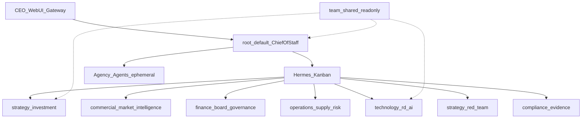

# CEO 战略办公室专家团队（PRD v1.8）实施计划

## 现状与目标

**现状**（[`scripts/inject-expert.sh`](scripts/inject-expert.sh)）：只把 `expert-templates/base` + `expert-templates/<expert>` 复制到单一 root Hermes Home，无命名 Profile / Kanban / `team.yaml`。

**目标**（PRD §1、§24）：

```text
1 容器 · 1 root/default 首席幕僚 · 7 永久命名 Profile · 1 Kanban · 1 Agency Agents 池 · 1 只读 team-shared
命令：bash scripts/create-instance.sh ceo-office 9600 ceo-strategic-office
```

**硬约束**：不合并 7 顾问进单 Prompt；不用纯 `delegate_task` 替代 Kanban；不为顾问开独立容器/端口；YAML 只用 PyYAML；不改 `create-instance.sh` 参数顺序。



---

## 阶段 1：Manifest Parser + 测试

**新增**
- [`scripts/lib/team_manifest.py`](scripts/lib/team_manifest.py) — CLI：`validate` / `resolve --instance` / `list-members`；输出稳定 JSON
- [`tests/test_team_manifest.py`](tests/test_team_manifest.py)
- [`tests/fixtures/mini-team/team.yaml`](tests/fixtures/mini-team/team.yaml) — 最小双 Profile fixture（root + 1 member）

**校验规则**（PRD §11.1）：`kind=hermes-profile-team`、`version=1`、root=`default`、成员 ID 合法且不重复、模板目录存在、编排=`kanban`、共享路径不逃逸 Hermes Home。

**验证**：`python3 -m pytest tests/test_team_manifest.py -q`

---

## 阶段 2：Profile 相对 Runtime Patch

**修改**
- [`scripts/patch-config-runtime.sh`](scripts/patch-config-runtime.sh) — 增加可选：`--profile-home` / `--workspace-path` / `--vault-path` / `--gbrain-home` / `--hindsight-bank-id`；无参时保持现有 root 默认
- [`scripts/lib/patch_config_runtime.py`](scripts/lib/patch_config_runtime.py) — 接受显式路径；增加：
  - root：`kanban.dispatch_in_gateway` + `delegation`（PRD §13.6）
  - 命名 Profile：MCP 路径指向 Profile Home；**不**启用独立 Dispatcher

**新增**：[`tests/test_patch_config_runtime.py`](tests/test_patch_config_runtime.py)

**验证**：无参调用后 writer 实例 config 行为与现网一致；带 `--profile-home` 时 bank/workspace 落在 `profiles/<id>/`

---

## 阶段 3：团队注入脚本（先 fixture 再真包）

**修改**
- [`scripts/inject-expert.sh`](scripts/inject-expert.sh) — 若存在 `expert-templates/<expert>/team.yaml`，转调 `inject-expert-team.sh`；否则走现有单专家逻辑（零行为变化）

**新增**
- [`scripts/inject-expert-team.sh`](scripts/inject-expert-team.sh) — 严格按 PRD §13.3：validate → staging 备份 → base+root → 7 命名 Profile（各 base+成员模板）→ `team-shared` 只读 → skills/plugins → runtime patch → 写 resolved `team.yaml` → 结构校验
- [`tests/test_inject_expert_team.sh`](tests/test_inject_expert_team.sh) — 用 mini-team fixture 测：成功注入、校验失败不污染线上、幂等二次注入

失败语义（PRD §18.1）：staging 未成功前不得替换线上；非零退出；保留 staging 供诊断。

`create-instance.sh` **仅继续调用** `inject-expert.sh`，不内嵌团队逻辑。

---

## 阶段 4：团队 Doctor

**新增** [`scripts/check-expert-team.sh`](scripts/check-expert-team.sh)（对照 [`scripts/check-sale-expert.sh`](scripts/check-sale-expert.sh) 风格）

检查项（PRD §13.7）：7 命名 Profile 结构、Bank ID 唯一、路径隔离、root Kanban 开 / 成员 Dispatcher 关、Router 存在、`team-shared` 只读、（容器已起时）WebUI/Gateway 健康、`hermes profile list` / `hermes kanban --help`、无成员独立 Gateway。

---

## 阶段 5：完整专家包 `ceo-strategic-office`

**新增目录** [`expert-templates/ceo-strategic-office/`](expert-templates/ceo-strategic-office/)（结构见 PRD §10）：

| 区域 | 内容 |
|------|------|
| `team.yaml` | PRD §11 完整 Manifest |
| `root/` | 首席幕僚 SOUL、决策等级路由、Kanban 编排规则、`config.patch.yaml`、memories、workspace/AGENTS.md |
| `profiles/<7>/` | 各顾问 SOUL + config.patch + memories + AGENTS（职责见 PRD §6.2–6.8） |
| `shared/` | COMPANY/CEO/BUSINESS-PORTFOLIO/GOVERNANCE/DECISION-RUBRIC/DATA-SOURCES/TEAM-ROSTER（骨架事实 + 审批边界；业务细节可后补） |
| `skills/` | ceo-team-orchestrator、executive-decision-brief、strategic-opportunity-review、investment-review、board-brief、risk-escalation、decision-log |
| `plugins/agency-agents-router/` | Vendor 进仓库的最小 Router（搜索 catalog / 加载 prompt / 经 `delegate_task` 执行）；不依赖创建时访问 GitHub |

SOUL/Skills 必须编码：D0–D4 路由（§7）、简报 12 段契约（§9）、保留动作与人工审批门（§17）。

---

## 阶段 6–7：隔离与工作流测试

- Agency：委派 Trend Researcher → 不创建永久 Profile、不写共享 memory
- Kanban：D3 投资评估 fixture → 顾问并行 → 综合 → red-team + compliance → 单份简报
- 证据缺失：无来源数字被 compliance 拦截

（运行时依赖容器内 `hermes profile` / `hermes kanban`；Doctor 在能力缺失时硬失败，禁止静默降级为 `delegate_task`。）

---

## 阶段 8–10：回归与非生产验收

```bash
# 单专家回归
bash scripts/create-instance.sh writer-reg 9611 writer
bash scripts/create-instance.sh finance-reg 9612 finance
bash scripts/create-instance.sh sale-reg 9613 sale

# 团队全新创建
bash scripts/create-instance.sh ceo-office 9600 ceo-strategic-office
bash scripts/up-instance.sh ceo-office
bash scripts/check-expert-team.sh ceo-office ceo-strategic-office

# 幂等
bash scripts/inject-expert.sh ceo-office ceo-strategic-office
```

预期：仅 `hermes-ceo-office`；WebUI `9600`；Gateway `29600`；root + 7 Profile；1 Dispatcher。

---

## 明确不改动

- Docker Compose 服务数 / 端口模型
- 现有 `expert-templates/{writer,finance,sale,default,base}` 语义
- `.env` 字段含义
- 已有实例不自动转团队

---

## 文档同步

本仓库为 `copilot-docker`（非 Portal monorepo）。完成后在 [`README.md`](README.md) 或 [`README_DEPLOY.md`](README_DEPLOY.md) 增加团队专家创建说明与 `check-expert-team.sh` 用法；不触碰父仓 `docs/INDEX.md` / `AGENTS.md`（除非用户另要求）。
