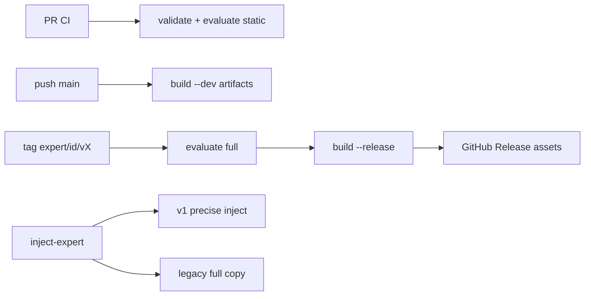

# CI/发布流水线 + 注入与运行时深化

## 范围锁定（实用优先）

**做：**
1. 扩展 CI：PR 已有 validate+evaluate → 增加主分支 Bundle 构建 Artifact；Release Tag 完整评测+构建+上传
2. `inject-expert.sh`：v1 Manifest **精确注入**（按 entrypoints/components，避免整包拷入 docs/prd/bin/tests）
3. Connector Slot **本地绑定样例**（example 声明 + env 缺项提示，不落 Secret）
4. Bundle **解压再校验**黄金测试

**不做：** nodeskclaw 服务端、真实 LLM 场景评测、改 Hermes Core。

现有基础：[`.github/workflows/expert-factory.yml`](.github/workflows/expert-factory.yml) 已覆盖 PR 五专家 `validate full` + `evaluate static` + pytest。

---

## 1. CLI 批处理能力（供 CI 调用）

在 [`expert-factory/src/workcopilot_expert_factory/cli.py`](expert-factory/src/workcopilot_expert_factory/cli.py) 增加：

| 能力 | 行为 |
|------|------|
| `validate --all` | 遍历 `expert-templates/*` 中含 `workcopilot.expert.v1` 的业务专家 |
| `evaluate --all --mode static` | 同上 |
| `build --all --dev` / 指定 id 列表 | 批量构建到 `dist/experts` |
| `validate --changed` / `evaluate --changed` | 基于 `git diff --name-only` 相对 `origin/master`（或 `GITHUB_BASE_REF`）过滤 `expert-templates/<id>/`；无变更则 skip 成功 |

实现放在 `services/batch.py`，避免 workflow 里手写循环逻辑分叉。

---

## 2. CI / 发布流水线

### 2.1 扩展现有 workflow + 新 release workflow

**PR / push（增强 [`expert-factory.yml`](.github/workflows/expert-factory.yml)）：**
- 保留全量五专家门禁（稳妥；`--changed` 作为可选加速 job，失败不挡主门禁）
- `push` 到 `master`/`main`：额外 job `build-dev-artifacts`：对五专家 `evaluate --mode static` + `build --dev`，`actions/upload-artifact` 上传 `dist/experts/*.expert.bundle` 与 `*.sha256`

**Release Tag（新建 [`.github/workflows/expert-release.yml`](.github/workflows/expert-release.yml)）：**
- 触发：`tags: ['expert/*/v*']`（对齐 PRD §17.3：`expert/<expert-id>/v<version>`）
- 解析 tag → `expert_id` + `version`，校验与 `expert.yaml` metadata 一致
- `validate --level full` → `evaluate --mode full` → `build --release`
- 创建 GitHub Release，上传 `.expert.bundle` / `.sha256` / `.build.json`
- 无 live `--runtime-profile`（实例不在 CI）

### 2.2 文档

更新 [`expert-factory/README.md`](expert-factory/README.md)、根 [`README.md`](README.md)、[`expert-factory/docs/nodeskclaw-api.md`](expert-factory/docs/nodeskclaw-api.md) 一小节：CI Artifact / Tag 产物如何被 nodeskclaw `POST /expert-packages/import` 使用。

---

## 3. 注入按 Manifest 精确化

### 3.1 问题

当前 [`inject-expert.sh`](scripts/inject-expert.sh) 对单专家执行 `cp -R "$TPL_EXPERT/." "$DATA_DIR/"`，会把 `docs/`、`prd/`、`bin/`、`evaluations/`、`expert.yaml`、`package.yaml` 等非运行资产打进 Hermes 数据目录。

### 3.2 方案

新增 [`scripts/lib/inject_from_manifest.py`](scripts/lib/inject_from_manifest.py)（或 factory 包内 `adapters/inject_runtime.py`，由 shell 调用）：

对 **v1 + 非 team** 专家：
1. 仍先注入 `expert-templates/base/`
2. 按 Manifest 拷贝：
   - `entrypoints.soul` / `agents` / `config_patch` → 目标相对路径（支持 `runtime/SOUL.md` → 实例根或保持相对结构；**约定**：若 soul 在 `runtime/`，将 `runtime/` 下运行文件提升/同步到实例约定位置，与现有 bi package install 行为对齐——单专家非 package：把 entrypoint 文件拷到 `DATA_DIR` 对应 basename 或保留子路径中与 Hermes 一致的那套；**锁定**：entrypoint 路径按 Manifest **原样相对拷贝到 DATA_DIR**，skills/plugins 按 `components.*.path` 原样拷贝）
   - `components.skills|tools|plugins|policies` 声明的 path
   - 若存在 `memories/` 且在 entrypoint 旁（如 `runtime/memories`），一并拷贝该目录
3. **排除**：`docs/`、`prd/`、`evaluations/`、`bin/`、`lib/`、`tests/`、`*.egg-info`、`package.yaml`、`expert.yaml`、`CHANGELOG.md`、`GUIDE.md`、`.git`
4. 其后流程不变：placeholder sed、`patch-config-runtime`、`merge_config_patch`、`init_hermes_dirs`

**Legacy**（无 v1）：保持现有整目录 `cp -R`。

**Team**：仍 `exec inject-expert-team.sh`（本轮不重写 team 注入）。

**bi package**：`create-instance` 仍走 `bin/install.sh`；本轮仅保证 v1+非 package 的 writer/finance/sale 受益；若有人直接 `inject-expert.sh bi-strategic-office`，走 Manifest 精确注入并拷贝声明的 `plugins/hermes-sqlbot-adapter` + `runtime/*` 入口，**不再**依赖旧 `hermes-finance-bi-plugin` 分支作为主路径（保留告警兼容）。

---

## 4. Connector Slot 本地绑定样例

1. 约定样例文件：`expert-templates/<id>/connectors/<slot-id>.example.yaml`（仅 id/capabilities/required_fields/env_key 映射，无 Secret）
2. 为 bi 增加 [`connectors/finance-query.example.yaml`](expert-templates/bi-strategic-office/connectors/finance-query.example.yaml)，映射到现有 `SQLBOT_*`（与 `config/sqlbot.example.env` 交叉引用）
3. CLI：`expert bind-check <expert-path> --env-file instances/
/.env`  
   - 读 Manifest `connector_slots` + example 映射  
   - 报告缺哪些 env key（不打印值）  
4. 可选：`inject` 结束后若存在 slots，自动跑 bind-check 并 WARN

---

## 5. Bundle 解压再校验黄金测试

在 [`expert-factory/tests/integration/`](expert-factory/tests/integration/) 新增：

1. 对 `writer`：`evaluate static` → `build --release`（或 `--dev` 若测试隔离评测结果）→ 解压 ZIP  
2. 断言存在 `manifest/bundle.json`、`manifest/expert.yaml`、`manifest/checksums.sha256`、`runtime/`  
3. 对解压出的 `manifest/expert.yaml` 做 schema 校验；校验 checksums 列表非空  
4. 禁止路径：`../`、绝对路径条目

---

## 6. 验收

- PR workflow 仍绿；main push 产出 artifact
- Tag `expert/writer/v2.0.0` 流程可在文档中复现（本地模拟 `build --release`）
- `inject-expert.sh writer writer` 后 `instances/writer/data/hermes` **无** `docs/`、`prd/`、`evaluations/`（有 v1 时）
- `expert bind-check` 对 bi 在缺 env 时给出清晰缺项列表
- 黄金测试通过；现有 14+ 单测不回归

### 关键改动文件

- [`expert-factory/src/workcopilot_expert_factory/cli.py`](expert-factory/src/workcopilot_expert_factory/cli.py)、`services/batch.py`、`adapters/inject_runtime.py`、`services/bind_check.py`
- [`scripts/inject-expert.sh`](scripts/inject-expert.sh)、[`scripts/lib/`](scripts/lib/)
- [`.github/workflows/expert-factory.yml`](.github/workflows/expert-factory.yml)、[`.github/workflows/expert-release.yml`](.github/workflows/expert-release.yml)
- bi `connectors/finance-query.example.yaml`；文档 README
- `expert-factory/tests/integration/test_bundle_roundtrip.py`
