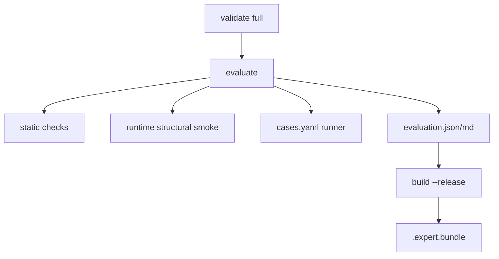

# Expert Factory：阶段四评测 + 阶段五迁移

## 已锁定实现决策

- **场景/任务用例不调用 LLM**：按 `evaluations/cases.yaml` 做确定性静态判定（Skill/权限/Connector/禁止项/触发词覆盖）。满足「CI 可跑静态评测」与「每 Case 独立记录」。
- **Runtime Smoke 默认结构型**：在 `.workcopilot/cache/eval-<id>/` 临时目录做可加载性检查（entrypoint、Skill、Plugin 语法/导入、MCP/配置可解析）；**不**改生产 `instances/`。可选 `--mode runtime --runtime-profile <p>` 对已有实例做带超时的健康/API smoke（实例不存在则跳过并标记 `skipped`，不拖垮 CI）。
- **bi 保留 package 安装链**：`workcopilot.expert.v1` 写入 [`expert.yaml`](expert-templates/bi-strategic-office/expert.yaml)；原 package 生命周期字段迁到同级 [`package.yaml`](expert-templates/bi-strategic-office/package.yaml)；[`create-instance.sh`](scripts/create-instance.sh) 判定改为 `package.yaml`（或兼容旧字段）+ 可执行 `bin/install.sh`。



---

## 1. 阶段四：`evaluate-expert`

### 1.1 新增模块（[`expert-factory/src/workcopilot_expert_factory/`](expert-factory/src/workcopilot_expert_factory/)）

| 模块 | 职责 |
|------|------|
| `evaluators/static.py` | Trigger 覆盖、Skill↔工具映射、permissions default=deny、connector_slots 完整性、输出契约引用、禁止事项章节、suite schema |
| `evaluators/runtime_smoke.py` | 临时 cache 目录；检查 soul/skills/plugins；`py_compile` / 可选 import plugin；超时控制 |
| `evaluators/cases.py` | 执行 `task` / `policy` / `security` / `resilience` / `smoke` 用例的确定性规则评分 |
| `evaluators/scoring.py` | PRD §13.4 权重聚合；安全 Gate 硬失败（Secret、未授权写、禁工具、未声明 Connector、敏感凭证） |
| `services/evaluate.py` | 编排；写 `evaluations/results/<id>/<version>/evaluation.json|md`（结果目录 gitignore，允许提交 fixtures） |

### 1.2 CLI（替换占位）

```bash
bash scripts/expert/expert evaluate <path> --mode static|runtime|full [--runtime-profile NAME] [--timeout 180]
```

- 退出码：通过 0；评测失败 1；参数错误 2；安全 Gate 失败 4
- 新增包装 [`scripts/expert/evaluate-expert.sh`](scripts/expert/evaluate-expert.sh)
- 更新 Factory Skill [`expert-factory/skills/evaluate-expert/SKILL.md`](expert-factory/skills/evaluate-expert/SKILL.md)

### 1.3 接入 `build`

改 [`builders/bundle.py`](expert-factory/src/workcopilot_expert_factory/builders/bundle.py) / CLI：

- `--dev`：可 `--skip-runtime-evaluation`（保持现状）
- `--release`：必须存在最近一次 `evaluation.json` 且 `passed`、`score >= minimum_score`、安全 Gate 通过；将真实结果写入 Bundle `manifest/evaluation.json`
- 缺评测时失败并提示先跑 `evaluate --mode full`

### 1.4 五专家评测集补强

在已有 writer/finance/sale 基础上扩充 cases（至少覆盖 task + policy + security；finance/bi 增加 resilience/connector）；bi/ceo 迁移时同步写入完整 suite。

### 1.5 CI

新增 [`.github/workflows/expert-factory.yml`](.github/workflows/expert-factory.yml)：

- `pip install -e expert-factory/[dev]`
- 对五个业务专家：`validate --level full` + `evaluate --mode static`
- 不强制 live runtime profile

### 1.6 Gitignore

补充：`.workcopilot/cache/`、`evaluations/results/`（若用仓库根结果目录）；与 PRD §20 对齐。

---

## 2. 阶段五：迁移 bi-strategic-office

1. 新增 v1 [`expert.yaml`](expert-templates/bi-strategic-office/expert.yaml)：
   - `metadata.id: bi-strategic-office`，版本从现有 `1.11.1` / `VERSION` 抬升为可发布 SemVer（如 `2.0.0`）
   - `entrypoints.soul: runtime/SOUL.md`，`config_patch: runtime/config.patch.yaml`
   - `components.skills` → `runtime/skills/*`
   - `components.plugins` → `plugins/hermes-sqlbot-adapter`
   - **`connector_slots`**：`finance-query`（type=mcp，read-only，`finance_bi_*` tools）；**不**写入 MCP URL / 密码
   - `permissions` default deny + 显式 allow BI 工具；`evaluations.suite`
2. 原 package 字段 → [`package.yaml`](expert-templates/bi-strategic-office/package.yaml)（lifecycle、required_env 仅作绑定声明名、security flags）
3. Skill 升 `workcopilot.skill.v1` + 九章正文（6 个 runtime skills）
4. `evaluations/cases.yaml`：正常问数、拒写 ERP、拒泄密、connector unavailable、禁 raw SQL
5. 调整 [`lib/validate_manifest.py`](expert-templates/bi-strategic-office/lib/validate_manifest.py)、[`bin/validate.sh`](expert-templates/bi-strategic-office/bin/validate.sh)：校验 v1 `expert.yaml` + `package.yaml`
6. [`create-instance.sh`](scripts/create-instance.sh)：`PACKAGE_MODE` = 存在可执行 `bin/install.sh` 且存在 `package.yaml`（若无 package.yaml 则回退：旧 `expert.yaml` 含 `lifecycle` 或仅 installer，保证不破坏）
7. 清理模板内生产连接实值（示例仅留 `config/sqlbot.example.env`）；更新模板 README
8. `validate --level full` + `evaluate --mode full` + `build --dev` 通过

---

## 3. 阶段五：迁移 ceo-strategic-office

1. 新增 v1 `expert.yaml`：`runtime.mode: team`；`entrypoints` 指向 `root/SOUL.md`、`team.yaml`
2. `components.skills` 登记 `skills/*`；plugin `agency-agents-router` 如存在则登记
3. 在 Manifest `extensions.team` 或 `provenance`/自定义段简要镜像 `team.yaml` 的 members（校验时：mode=team 必须有 team.yaml/root/profiles，与现有 validator 一致）
4. 升级 7 个共享 Skill frontmatter + 标准章节
5. `evaluations/cases.yaml`：委托编排、汇总简报、拒越权写、拒泄密、治理审批边界
6. `policies/` 最小 tool/data；更新 README
7. structure/full + evaluate + build --dev；确认 `inject-expert-team.sh` 仍可用（structure 预检已支持 root/SOUL）

---

## 4. 文档与规则同步

- 更新 [`expert-factory/README.md`](expert-factory/README.md)、根 [`README.md`](README.md)（五专家均为 v1；evaluate/build --release）
- 更新 [`expert-factory/skills/build-expert/SKILL.md`](expert-factory/skills/build-expert/SKILL.md)、evaluate Skill
- [`.cursor/rules/expert-factory-create.mdc`](.cursor/rules/expert-factory-create.mdc)：创建后建议 `evaluate --mode static`
- 模板 README：bi/ceo 变更要点（协议、Connector Slot、评测、package.yaml）

---

## 5. 测试与验收

- 单元：scoring、case runner、安全 Gate、runtime smoke（无 Docker）
- 集成：五专家 `validate full` + `evaluate --mode static` 均通过
- 至少一专家 `build --release` 在已有 evaluation 结果时成功；`--release` 无评测时失败
- bi：`package.yaml` + `bin/install.sh` 路径在 create-instance 逻辑上仍进入 package mode（脚本级断言或单测 mock）
- **不做**：真实 LLM 多轮场景评测、nodeskclaw 服务端

### 完成标准（对应 PRD）

- 五类业务专家均有评测集且静态评测可 CI 执行
- `evaluate-expert` 产出可读报告；安全 Gate 不可跳过
- `build --release` 读取评测结果；`--dev` 可区分
- bi/ceo 含 v1 `expert.yaml`，Skill 统一协议，可打 Expert Bundle
- 旧 inject / create-instance / package install 保持可用
