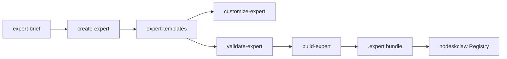

# WorkCopilot Expert Factory v2.0（核心优先）

## 范围决策（已锁定）

**本次做：** 阶段一～三 + 第一批三专家迁移（`writer` / `finance` / `sale`）+ Cursor 创建规则 + 根 [README.md](README.md) 产品化改写。

**本次不做：** `evaluate-expert` 完整实现、Runtime Smoke/场景评测、`bi-strategic-office` / `ceo-strategic-office` 迁移、完整 CI Release 流水线。`build --dev` 允许跳过评测门禁，以便在无 evaluate 时仍可产出开发包。

**创建方式约定：** `create-expert` / `customize-expert` = **Agent Skill 编排正文** + **Python CLI 确定性脚手架/校验**；CLI 不内嵌 LLM API。



---

## 1. 协议与 Schema（阶段一）

在 [expert-factory/](expert-factory/) 新建独立 Python 包（按 PRD §9.1 / §9.2）：

| 路径 | 内容 |
|------|------|
| `expert-factory/schemas/*.schema.json` | `expert-v1` / `skill-v1` / `connector-slot-v1` / `evaluation-suite-v1` / `expert-bundle-v1` |
| `expert-factory/src/workcopilot_expert_factory/models/` | Pydantic 模型，与 Schema 对齐 |
| `expert-factory/docs/nodeskclaw-api.md` | Bundle 导入 API 契约（PRD §8.5，供 nodeskclaw 对接；本仓只写契约文档） |
| `expert-factory/templates/{single-expert,team-expert,skill}/` | 脚手架骨架 |

关键协议要点（实现时严格按 PRD §8）：

- 每个可发布专家根目录必须有 `expert.yaml`，`schema_version: workcopilot.expert.v1`
- `metadata.id` = 目录名；`runtime.mode`: `single` | `team`
- 外部系统只声明 `connector_slots`，禁止模板写生产 Secret / 具体 MCP URL
- Skill 使用 `workcopilot.skill.v1` frontmatter + 固定正文章节
- Expert Bundle = ZIP（`.expert.bundle`），与现有 Asset Bundle **并存不合并**

兼容注意：现有 [bi-strategic-office/expert.yaml](expert-templates/bi-strategic-office/expert.yaml) 是 **package schema_version: 1**，本轮不迁移；`validate` 对无 `workcopilot.expert.v1` 的模板走 Legacy 警告路径，不强制失败（除非显式 `--level full` 且目标已声明 v1）。

---

## 2. Python CLI 与 Shell 包装（阶段二～三）

包入口：`workcopilot_expert_factory.cli`（Typer + Rich）。

统一入口与包装脚本：

```text
scripts/expert/expert
scripts/expert/{create,customize,validate,build}-expert.sh
```

| 子命令 | 行为 |
|--------|------|
| `validate` | structure / schema / security / full；Secret 扫描、路径安全、组件引用完整性、权限 default=deny 检查；输出 JSON+文本 |
| `build` | 校验通过后打 ZIP；写 `bundle.json` / checksums / source.json；`--dev --skip-runtime-evaluation` 为默认开发路径（本轮无 evaluate） |
| `create` | 读 brief → 写 `.workcopilot/drafts/<id>/{expert-brief,expert-plan}.yaml` → scaffold 目录与 stub → 调 structure 校验；`--plan-only` 只出计划 |
| `customize` | 从已有专家派生到新目录，写 `provenance.derived_from` + customization report，**不改源专家** |

Factory Skills（给 Cursor Agent 用的生产流程，非 Hermes 运行时 Skill）：

- `expert-factory/skills/create-expert/SKILL.md`（+ references/examples）
- `expert-factory/skills/customize-expert/SKILL.md`
- `expert-factory/skills/validate-expert/SKILL.md`、`build-expert/SKILL.md`（轻量：说明何时调 CLI）

`evaluate-expert` Skill/CLI：**本轮只留 stub 目录或文档占位**，不实现。

---

## 3. Legacy 兼容改造

| 现有脚本 | 调整 |
|----------|------|
| [scripts/validate-expert-template.sh](scripts/validate-expert-template.sh) | 改为转调 `scripts/expert/expert validate ... --level full`（保留旧字符/中文检查：并入 validator 或作为 full 的一步） |
| [scripts/inject-expert.sh](scripts/inject-expert.sh) | 注入前 `validate --level structure`；有 v1 `expert.yaml` 按 Manifest 路径注入，否则 Legacy + 警告 |
| [scripts/promote-bundle-to-template.sh](scripts/promote-bundle-to-template.sh) | 打印 Legacy Asset Flow 提示 |
| Asset Bundle 三件套 | **保留不动**，文档标明与 Expert Bundle 边界 |

现有实例创建/启停/`create-instance.sh` 行为保持可用。

---

## 4. 第一批专家迁移（writer / finance / sale）

对每个模板：

1. 新增根级 `expert.yaml`（`mode: single`，登记 skills/policies，connector_slots 按需；writer 可为空或文档类 slot）
2. 各 `SKILL.md` 升级到 `workcopilot.skill.v1` frontmatter + 标准章节（正文仍简体中文）
3. 补 `evaluations/cases.yaml`（结构合法，供后续 evaluate；本轮只校验 schema）
4. 补最小 `policies/`（tool/data 与 permissions 对齐）
5. 更新模板 `README.md`（协议字段、校验/构建命令）
6. `validate --level full` + `build --dev` 通过

不迁移：`base/`、`default/`、`bi-strategic-office/`、`ceo-strategic-office/`。

---

## 5. 标准创建规则（Cursor）

扩展/新建规则（在现有 [`.cursor/rules/expert-template-docs.mdc`](.cursor/rules/expert-template-docs.mdc) 旁）：

新建 **`.cursor/rules/expert-factory-create.mdc`**（`alwaysApply` 或 globs 覆盖 `expert-templates/**`、`expert-factory/**`），强制：

- 新建单专家 / 团队专家 / Skill 必须走 `workcopilot.*.v1` 协议与目录规范
- 必须含 `expert.yaml`（业务模板）；团队另需合法 `team.yaml` + `root/` + `profiles/`
- Skill：一 Skill 一职责、无循环依赖、外部系统只走 Connector Slot、默认 deny、禁止 Secret
- 创建后必须跑 `scripts/expert/expert validate <path> --level structure`（及文档字符校验）
- 保留原规则中的简体中文 + 禁控制字符 + README 分工

同步更新 `expert-template-docs.mdc`：校验命令改为新 CLI；根 README「仅登记新增」与产品化 README 的关系写清（产品定位写根 README，专家详情仍在模板 README）。

---

## 6. 根 README 产品化改写

重写 [README.md](README.md) 结构（运维命令保留，但升格产品叙事）：

1. **产品定位**：WorkCopilot Expert Factory（源码生产 / 定制 / 校验 / 构建）
2. **边界**：vs nodeskclaw（控制面）vs Hermes（运行时）
3. **生产链路**：create → customize → validate → build → Bundle
4. **协议一览**：expert / skill / connector_slot / Expert Bundle vs Asset Bundle
5. **快速开始**：Factory CLI + 原有实例部署（可折叠或次级章节）
6. **专家索引表**：仍只登记路径 + 一句话（含迁移后的三专家）
7. 指向 `expert-factory/README.md`、`prd/v2.0_work-expert-factory.md`

---

## 7. 测试与验收（本轮）

- `expert-factory/tests/unit/`：Schema/Model、Secret 扫描、路径安全、bundle 往返
- 集成：对 `writer`/`finance`/`sale` 跑 validate + build --dev
- Golden：至少一个 scaffold 专家夹具
- **不做** evaluate 评分与五专家全量评测集执行

本轮完成标准：

- 三专家具备 v1 `expert.yaml` 且 `validate --level full` 通过
- 可产出 `.expert.bundle`（dev 模式）
- `create` 能从 brief scaffold 出可通过 structure 校验的目录
- `customize` 派生不污染源
- 旧 inject/create-instance 仍可用
- Cursor 创建规则与根 README 已更新

---

## 关键文件落点

- 新增：`expert-factory/**`、`scripts/expert/**`、`.cursor/rules/expert-factory-create.mdc`、`dist/experts/.gitkeep`
- 改：`scripts/validate-expert-template.sh`、`scripts/inject-expert.sh`、`scripts/promote-bundle-to-template.sh`、`expert-templates/{writer,finance,sale}/**`、`README.md`、`.cursor/rules/expert-template-docs.mdc`
- 文档：`expert-factory/README.md`、`expert-factory/docs/nodeskclaw-api.md`；可选短注 `README_ASSET_BUNDLES.md` 标明与 Expert Bundle 边界
