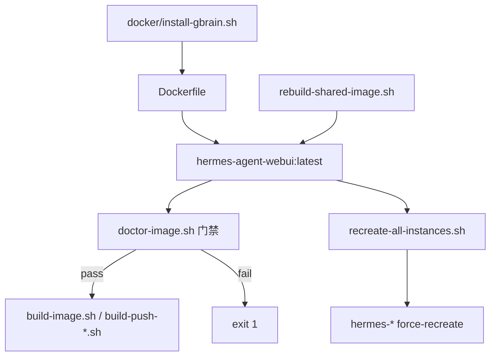

# PRD v1.4.1 Hotfix 实施计划

## 背景：v1.4 已做 vs 仍 Broken

v1.4 已完成：`GBRAIN_REF` 贯穿 compose/env/registry、config 绝对路径 `/usr/local/bin/gbrain`、`skill-inbox`、`doctor-image.sh` 骨架、`recreate-all-instances.sh`、`up-instance --no-cache` 等。

**根因未关闭**：[`Dockerfile`](Dockerfile) 仍用内联 `bun install` + `find ... gbrain`，与 PRD §2.2 指出的失败模式一致（postinstall 被 block → `GBRAIN_BIN` 为空 → 构建失败或旧镜像残留）。

```133:160:Dockerfile
      bun install; \
      (bun install -g /opt/gbrain || npm install -g .); \
      GBRAIN_BIN="$(find /opt/bun /root/.bun ... -name gbrain ...)"; \
      test -n "$GBRAIN_BIN"; \
```

v1.4.1 核心变更：**抽出 `docker/install-gbrain.sh`，以 `npm install -g .` 为主路径，wrapper 回退，构建/推送强制 doctor 门禁**。



---

## 阶段 1：GBrain 安装脚本（P0）

### 1.1 新增 [`docker/install-gbrain.sh`](docker/install-gbrain.sh)

按 PRD §6.1 完整实现：

- Bun 安装到 `/opt/bun`（`BUN_VERSION` 可配置，默认 `bun-v1.2.15`）
- `git clone --branch GBRAIN_REF`，branch 失败 fallback 默认分支
- `npm ci`/`npm install` 依赖
- **`npm install -g .`** 作为主安装路径（不再 `bun install -g`）
- 若 `command -v gbrain` 失败：从 `package.json` bin 写 `/usr/local/bin/gbrain` wrapper（`exec bun "$BIN_ABS"`）
- 最终 `command -v gbrain` + `gbrain --help` 验收，失败则 exit 非 0

### 1.2 修改 [`Dockerfile`](Dockerfile)

删除第 133–169 行内联 GBrain RUN 段，替换为 PRD §6.2：

```dockerfile
ARG BUN_VERSION=bun-v1.2.15
COPY docker/install-gbrain.sh /usr/local/bin/install-gbrain.sh
RUN chmod +x /usr/local/bin/install-gbrain.sh \
  && INSTALL_GBRAIN="${INSTALL_GBRAIN}" \
     GBRAIN_REPO="${GBRAIN_REPO}" \
     GBRAIN_REF="${GBRAIN_REF}" \
     BUN_VERSION="${BUN_VERSION}" \
     /usr/local/bin/install-gbrain.sh
```

保留现有权限段（`/opt/bun`、`/opt/gbrain` chown/chmod 已具备）。

---

## 阶段 2：BUN_VERSION 参数补齐

| 文件 | 变更 |
|------|------|
| [`docker-compose.yml`](docker-compose.yml) | build args 增加 `BUN_VERSION: ${BUN_VERSION:-bun-v1.2.15}` |
| [`scripts/create-instance.sh`](scripts/create-instance.sh) | `.env` 模板增加 `BUN_VERSION=bun-v1.2.15` |
| [`.env.example`](.env.example) | 增加 `BUN_VERSION=bun-v1.2.15` |
| [`local-registry.env.example`](local-registry.env.example) | 增加 `BUN_VERSION`；`IMAGE_TAG` 改为 `v1.4.1-hotfix-gbrain` |
| [`registry.env.example`](registry.env.example) | 增加 `BUN_VERSION=bun-v1.2.15` |
| [`scripts/build-push-local-registry.sh`](scripts/build-push-local-registry.sh) | 读取并传入 `--build-arg BUN_VERSION` |
| [`scripts/build-push-registry.sh`](scripts/build-push-registry.sh) | 同上 |

### 旧实例 `.env` 补丁

在 [`scripts/repair-existing-instances.sh`](scripts/repair-existing-instances.sh) 循环中追加（用户确认方案）：

```bash
grep -q '^GBRAIN_REF=' "$ENV_FILE" || echo 'GBRAIN_REF=master' >> "$ENV_FILE"
grep -q '^BUN_VERSION=' "$ENV_FILE" || echo 'BUN_VERSION=bun-v1.2.15' >> "$ENV_FILE"
```

---

## 阶段 3：构建/验收/重建脚本

### 3.1 增强 [`scripts/doctor-image.sh`](scripts/doctor-image.sh)（PRD §10）

补全检查项：`/etc/os-release`、`bun`/`bun --version`、`ls -l $(which gbrain)`、`node`/`npm` 版本；保留 AIAgent import。

### 3.2 新增 [`scripts/rebuild-shared-image.sh`](scripts/rebuild-shared-image.sh)（PRD §11）

- 用法：`bash scripts/rebuild-shared-image.sh <profile> [--no-cache]`
- 使用 `-p hermes-image-build` + `--pull --progress=plain`
- 构建后**自动**调用 `doctor-image.sh`，失败 exit 1

### 3.3 已有 [`scripts/recreate-all-instances.sh`](scripts/recreate-all-instances.sh)

与 PRD §12 一致，**无需修改**。

### 3.4 修改 [`scripts/build-image.sh`](scripts/build-image.sh)（PRD §13.2）

- build 增加 `--progress=plain`
- 构建成功后执行 `bash scripts/doctor-image.sh "$LOCAL_IMAGE"`，**失败则 exit 1**（替换当前仅 echo 提示）

### 3.5 修改 [`scripts/up-instance.sh`](scripts/up-instance.sh)（PRD §9.2–§9.3）

- build 时加 `--progress=plain`
- `[skip]` 提示补全 force-recreate 命令：

```text
docker compose --env-file instances/<profile>/.env -p hermes-<profile> up -d --no-build --force-recreate
```

- 默认 `up -d` 保持 `--no-build` 语义（不 force-recreate，避免误重建；镜像更新走 `recreate-all-instances.sh`）

---

## 阶段 4：Registry 推送门禁

### [`scripts/build-push-local-registry.sh`](scripts/build-push-local-registry.sh)（PRD §14.3）

在 `docker push` 之前：

```bash
bash scripts/doctor-image.sh "$LOCAL_IMAGE_NAME"
```

未通过则 exit 1，禁止推送。

### [`scripts/build-push-registry.sh`](scripts/build-push-registry.sh)

同样增加推送前 `doctor-image.sh` 门禁（PRD §20 列入必须修改项）。

---

## 阶段 5：config 与文档

### config（v1.4 已完成，本 hotfix 仅确认）

[`scripts/lib/patch_config_runtime.py`](scripts/lib/patch_config_runtime.py)、[`expert-templates/base/config.yaml`](expert-templates/base/config.yaml) 已为 `/usr/local/bin/gbrain` + `args: []`，**无需改动**。

### 文档更新

- [`README_DEPLOY.md`](README_DEPLOY.md)：标准流程改为 `rebuild-shared-image.sh` → `recreate-all-instances.sh`；强调 build 后 doctor 门禁、force-recreate vs restart 区别
- [`README_LOCAL_REGISTRY.md`](README_LOCAL_REGISTRY.md)：`BUN_VERSION`、`v1.4.1-hotfix-gbrain` tag、推送前 doctor 说明

---

## 验收（PRD §21，Linux 构建机）

```bash
bash scripts/rebuild-shared-image.sh common-writer --no-cache
bash scripts/doctor-image.sh hermes-agent-webui:latest
bash scripts/recreate-all-instances.sh

docker exec hermes-common-writer bash -lc 'which gbrain; gbrain --help 2>&1 | head -80'
docker logs --tail=200 hermes-common-writer | grep -i "missing executable\|gbrain: command not found" && exit 1 || echo OK
```

**通过标准：**
- `which gbrain` → `/usr/local/bin/gbrain`
- 日志无 `missing executable 'gbrain'`
- 所有 `hermes-*` 容器 Image ID 与 latest 一致

---

## 不在范围

- Hermes Agent / GBrain 源码改动
- Registry pull 集成到 `up-instance.sh`
- `bootstrap-self-evolution-stack.sh` 缺失修复
