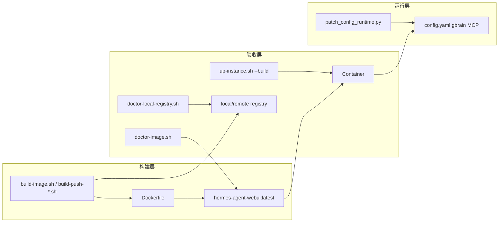

# PRD v1.4：GBrain 安装与 Local Registry 治理实施计划

## 现状与差距

当前 [`Dockerfile`](Dockerfile) 仍使用错误的 `bun install -g "${GBRAIN_REPO}"`，失败被 `|| echo WARN` 吞掉，可能产出缺 `gbrain` 的镜像：

```125:135:Dockerfile
ARG INSTALL_GBRAIN=1
ARG GBRAIN_REPO=http://git.superic.com/aiplatform/gbrain.git
RUN if [ "${INSTALL_GBRAIN}" = "1" ]; then \
      (curl -fsSL https://bun.sh/install | bash -s -- bun-v1.2.15 \
        ...
        && bun install -g "${GBRAIN_REPO}" \
        ...
      || echo "WARN: gbrain install failed; init-brain-runtime.sh will skip gbrain."; \
    fi
```

其余缺口汇总：

| 文件 | 状态 |
|------|------|
| `docker-compose.yml` | 缺 `GBRAIN_REF` build arg、`GBRAIN_COMMAND` env |
| `create-instance.sh` | 缺 `GBRAIN_REF`；缺 `webui/attachments` 目录 |
| `up-instance.sh` | 缺复用镜像提示、`--no-cache` 参数 |
| `build-push-*.sh` | 缺 `GBRAIN_REF` 读取与 build-arg |
| `registry.env.example` / `local-registry.env.example` | 缺 `GBRAIN_REF` |
| `scripts/doctor-image.sh` | **不存在** |
| `patch_config_runtime.py` / `init-brain-runtime.sh` / `expert-templates/base/config.yaml` | gbrain command 仍为 `gbrain`，args 为 `["serve"]` |



---

## 阶段 1：Dockerfile GBrain 安装重写（核心）

修改 [`Dockerfile`](Dockerfile) 第 125–163 行：

1. **新增构建参数与环境变量**（PRD §5.1）：
   - `ARG GBRAIN_REF=master`
   - `ENV BUN_INSTALL=/opt/bun`
   - `ENV PATH=/opt/bun/bin:/usr/local/bin:$PATH`

2. **替换 GBrain 安装 RUN 段**（PRD §5.2）：
   - `set -eux` 全程 fail-fast
   - Bun 安装到 `/opt/bun`，软链到 `/usr/local/bin`
   - `git clone --depth=1 --branch "${GBRAIN_REF}"` 到 `/opt/gbrain`
   - `bun install` + `(bun install -g /opt/gbrain || npm install -g .)`
   - `find` 定位二进制 → `ln -sf` 到 `/usr/local/bin/gbrain`
   - 构建验收：`command -v gbrain`（失败则 build 失败）
   - **删除** `|| echo "WARN: gbrain install failed"`

3. **扩展权限段**（PRD §5.3）：
   - `chown` / `chmod` 追加 `/opt/bun`、`/opt/gbrain`

---

## 阶段 2：Compose 与 env 模板统一

### [`docker-compose.yml`](docker-compose.yml)

- build args 增加：`GBRAIN_REF: ${GBRAIN_REF:-master}`
- environment 增加：`GBRAIN_COMMAND: ${GBRAIN_COMMAND:-/usr/local/bin/gbrain}`
- ports 段增加注释掉的 Gateway 端口映射（PRD §6.3，默认不开放）

### 实例与示例 env

- [`scripts/create-instance.sh`](scripts/create-instance.sh)：`.env` 模板增加 `GBRAIN_REF=master`；`mkdir` 增加 `"$DATA_DIR/webui/attachments"`
- [`.env.example`](.env.example)：补充 `INSTALL_GBRAIN`、`GBRAIN_REPO`、`GBRAIN_REF`（供 `build-image.sh` 无 instance 时使用）
- [`registry.env.example`](registry.env.example)：增加 `GBRAIN_REF=master`
- [`local-registry.env.example`](local-registry.env.example)：增加 `GBRAIN_REF=master`；`IMAGE_TAG` 更新为 `v2026.6.15`

---

## 阶段 3：构建/启动/Registry 脚本

### [`scripts/up-instance.sh`](scripts/up-instance.sh)

- 参数解析改为循环，支持 `--build`、`--no-cache`（可组合）
- `--no-cache` → `docker compose ... build --no-cache`
- `--build` → 普通 `build`（若同时有 `--no-cache` 则加 `--no-cache`）
- `[skip]` 分支增加 PRD §8.2 提示：Dockerfile 变更后需 `--build` 或 `build-image.sh --no-cache`

### [`scripts/build-image.sh`](scripts/build-image.sh)

- 构建成功后追加提示：运行 `bash scripts/doctor-image.sh "$LOCAL_IMAGE"` 做镜像验收

### [`scripts/build-push-registry.sh`](scripts/build-push-registry.sh) 与 [`scripts/build-push-local-registry.sh`](scripts/build-push-local-registry.sh)

- 读取 `GBRAIN_REF="${GBRAIN_REF:-master}"`
- BUILD_ARGS 增加 `--build-arg "GBRAIN_REF=${GBRAIN_REF}"`

### 新增 [`scripts/doctor-image.sh`](scripts/doctor-image.sh)

按 PRD §10 实现：

```bash
bash scripts/doctor-image.sh
bash scripts/doctor-image.sh hermes-agent-webui:latest
```

检查项：`python -V`、`AIAgent import`、`which gbrain`、`gbrain --help`（前 80 行）

---

## 阶段 4：config 模板与 MCP 路径（PRD §17）

用户确认：**严格按 PRD** — `command: /usr/local/bin/gbrain`，`args: []`

需同步修改 4 处：

1. [`scripts/lib/patch_config_runtime.py`](scripts/lib/patch_config_runtime.py)
   - gbrain command → `/usr/local/bin/gbrain`
   - args → `[]`
   - 新增 CLI 参数 `--gbrain-enabled`（默认 true），`enabled: false` 当 `GBRAIN_ENABLED=0`

2. [`scripts/patch-config-runtime.sh`](scripts/patch-config-runtime.sh)
   - 从 instance `.env` 读取 `GBRAIN_ENABLED`、`GBRAIN_COMMAND`，传给 Python 脚本

3. [`scripts/init-brain-runtime.sh`](scripts/init-brain-runtime.sh) 内嵌 Python
   - 同步 command/args；`enabled` 读取 `GBRAIN_ENABLED` 环境变量

4. [`expert-templates/base/config.yaml`](expert-templates/base/config.yaml)
   - gbrain MCP 段改为绝对路径 + `args: []`

---

## 阶段 5：文档更新

### [`README_DEPLOY.md`](README_DEPLOY.md)

- §4 构建参数：补充 `GBRAIN_REF`
- 新增/更新 **镜像验收** 小节：`doctor-image.sh` 用法与通过标准
- §14 build-push 示例 build-arg 增加 `GBRAIN_REF`
- §15 本地 Registry 流程末尾增加 `doctor-image.sh` 建议步骤
- 实例验收命令对齐 PRD §18.2（`grep gbrain config.yaml`）

### [`README_LOCAL_REGISTRY.md`](README_LOCAL_REGISTRY.md)

- 配置示例增加 `GBRAIN_REF=master`、`IMAGE_TAG=v2026.6.15`
- 发布流程增加构建后 `doctor-image.sh` 步骤

---

## 验收计划（PRD §18）

实施完成后在 **Linux 构建机**（需访问 `git.superic.com`）执行：

```bash
# 18.1 镜像级
bash scripts/build-image.sh --no-cache
bash scripts/doctor-image.sh hermes-agent-webui:latest

# 18.2 实例级
bash scripts/up-instance.sh <profile> --build
docker exec hermes-<profile> bash -lc 'which gbrain; grep -n gbrain -A8 /data/hermes/config.yaml'
docker logs --tail=200 hermes-<profile> | grep -i "gbrain\|missing executable"

# 18.3 Registry 级（需 local-registry.env 已配置）
bash scripts/build-push-local-registry.sh --tag v2026.6.15
bash scripts/doctor-local-registry.sh
```

**通过标准：**
- `which gbrain` → `/usr/local/bin/gbrain`
- config.yaml 中 `command: /usr/local/bin/gbrain`
- 日志无 `missing executable 'gbrain'`
- `doctor-local-registry.sh` 0 fail

---

## 风险与注意事项

1. **GBrain package.json 无 bin 字段**：构建日志会打印 `cat package.json`，需 GBrain 仓库侧配合
2. **args 改为 `[]`**：按 PRD 与用户确认执行；若 MCP 启动异常，需回查 GBrain CLI 默认行为
3. **旧实例**：Dockerfile 修复后必须 `--build` 或 `--no-cache` 重建；已有 config 需 `bash scripts/patch-config-runtime.sh <profile>` 刷新 gbrain 段
4. **Windows 开发机**：Docker 构建/验收需在 Linux 或 WSL2 + Docker 环境执行；`configure-insecure-registry.sh` 仅适用 Linux

---

## 不在本 PRD 范围（明确跳过）

- Registry pull 集成到 `up-instance.sh`（PRD 非目标 / 未列入 §21 交付清单）
- `bootstrap-self-evolution-stack.sh` 缺失问题（与 v1.4 无关）
- Hermes Agent 内部 GBrain 业务逻辑改造
