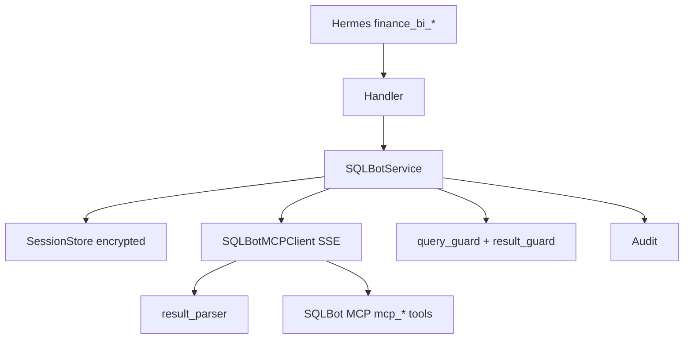

# v1.11.1 Hotfix：hermes-sqlbot-adapter 修复

## 根因判断

当前 [mcp_client.py](expert-templates/bi-strategic-office/plugins/hermes-sqlbot-adapter/sqlbot_adapter/client/mcp_client.py) 用 **httpx POST JSON-RPC** 模拟 MCP，与生产已验证的 **MCP SSE + `ClientSession`** 路径不一致。Hotfix 必须把已验证直连逻辑迁入正式 Client，并补齐错误解析、会话加密与 Doctor 分层。



## 约束

- 只改 `expert-templates/bi-strategic-office/`
- 不改 SQLBot / Hermes 核心 / 公共 `scripts/*`
- Handler 始终返回 JSON 字符串，不向 Agent Loop 抛异常
- 同步 Handler + **AsyncBridge**（专用后台线程 + 固定事件循环 + `run_coroutine_threadsafe`）；禁止 handler 内 `asyncio.run()` / 手工 `__aenter__`

## 实施步骤

### T01–T02：版本与盘点

- `VERSION` / `expert.yaml` / `plugin.yaml` / `CHANGELOG.md` / `README.md` → **1.11.1**
- `required_env` / `plugin.yaml requires_env` 增加 `SQLBOT_SESSION_ENCRYPTION_KEY`
- PRD 存档：`prd/bi-strategic-office-prd-v1.11.1_hotfix.md`（复制根 `prd/v1.11.1_hotfix.md`）
- 删除重复脚本：`memories/test_sqlbot.py` 等独立 MCP 实现；正式入口仅 `plugins/.../scripts/direct_flow_test.py`（调用正式 `SQLBotMCPClient`）

### T03–T05：MCP Client + Result Parser

重写 [client/mcp_client.py](expert-templates/bi-strategic-office/plugins/hermes-sqlbot-adapter/sqlbot_adapter/client/mcp_client.py)：

- 依赖锁定 [requirements.txt](expert-templates/bi-strategic-office/plugins/hermes-sqlbot-adapter/requirements.txt)：

```text
mcp==1.26.0
anyio==4.14.2
httpx==0.28.1
sqlglot>=26,<27
cryptography>=43,<45
PyYAML>=6.0,<7
```

- 类名：`SQLBotMCPClient`
- 固定工具常量：`mcp_start` / `mcp_question` / `mcp_ws_list` / `mcp_datasource_list`
- 每次调用：`async with sse_client(url) as (r,w): async with ClientSession(...)` → initialize → `call_tool` → 关闭
- `list_tools()` 仅 Doctor/调试；业务路径不依赖
- 超时：`SQLBOT_CONNECT_TIMEOUT_SECONDS` / `LOGIN` / `REQUEST`；initialize/`mcp_start` 网络失败重试 1 次；`mcp_question` 与 SQL 执行错误不重试

新增 `client/result_parser.py`：支持 TextContent / structuredContent / JSON / Markdown fence / 嵌套 `message` JSON（最多 3 层）；提取 sql/rows/columns/chart；识别 `exec-sql-err`。

### T06：错误体系

新增 `errors.py`（或扩展 `contracts.py`），错误码按 PRD §11，重点：

- `DetachedInstanceError` → `SQLBOT_DATASOURCE_SESSION_ERROR`（`source=sqlbot`, `retryable=false`）
- 完整 traceback 只写审计，不进 Tool Result
- 区分 transport / initialize / auth / generation / execution

### T07：Session Store Schema v2

重写 [session/session_store.py](expert-templates/bi-strategic-office/plugins/hermes-sqlbot-adapter/sqlbot_adapter/session/session_store.py)：

- 表 `sqlbot_sessions`：`profile_name + hermes_session_id + hermes_user_id` PK；`access_token_encrypted`（Fernet + `SQLBOT_SESSION_ENCRYPTION_KEY`）；`sqlbot_chat_id`
- 表 `sqlbot_queries`：query 审计
- 缺加密 Key → 配置失败（`SQLBOT_NOT_CONFIGURED`），禁止明文回退
- SQL 执行失败 / Datasource Session Error：**保留**映射；reset 才删；Token 失效删后重登一次

新增 `session/models.py`、`scripts/init_state.py`；`install.sh` 调用初始化 Schema，写 `package-state.yaml`（`schema_version: 2`, `expert_version: 1.11.1`）。

### T08–T09：Service + Handlers + Runtime Context

- 新增顶层 `sqlbot_adapter/service.py`（从 `handlers/service.py` 上移并重写）
- 新增 `runtime_context.py`：从 Hermes ctx/环境取 `profile_name` / `hermes_session_id` / `hermes_user_id`；**禁止**模型传 session/user/token/chat_id；CLI 默认 `local-cli`；取不到 → `RUNTIME_CONTEXT_UNAVAILABLE`
- 更新 [schemas.py](expert-templates/bi-strategic-office/plugins/hermes-sqlbot-adapter/schemas.py)：去掉 `session_id`/`user_id` 参数
- Handler（ask/followup/explain/reset）→ Service → 统一 `json_ok`/`json_err`

### T10–T12：Guard / Result / Audit

- Query Guard：只读 SQL + 显式标识符；SQL 已生成但执行失败时仍校验 SQL 并审计
- Result Guard：硬上限 500 → `RESULT_TOO_LARGE`；模型 100 行截断；脱敏
- Audit：request_id/query_id/error_code；无密码/Token/完整结果集

### T13：Doctor / 生命周期

更新 [bin/doctor.sh](expert-templates/bi-strategic-office/bin/doctor.sh)：

- 默认：plugin / toolset / env / MCP reachable / initialize / ping / store&audit 可写；`tools/list` 异常仅 WARN
- `--deep`：才 `mcp_start` + workspace/datasource；SQL 执行失败标 FAIL + 错误码
- 不打印 Token；默认不创建 chat_id

更新 `install.sh`：确保创建 `sqlbot-adapter/state|audit`、跑 `init_state.py`、写 package-state（修复此前目录未落盘问题的根因：install 必须真正执行且幂等建目录）。

更新 `post-start.sh`：校验 `mcp==1.26.0` 等版本；MCP initialize/ping；默认不做 `mcp_start`。

更新 `update.sh`：备份 plugin + SQLite；schema migration；失败可回滚说明。

### T14–T16：测试与文档

- 插件内 `tests/unit|integration|security` + 专家包 `tests/` 对齐新错误码与 SSE Client（Mock）
- 覆盖：SSE 生命周期、嵌套 JSON、`DetachedInstanceError` 映射、会话隔离、密钥缺失失败、secrets 不进 Tool Result
- 文档：`docs/sqlbot-integration.md` / `troubleshooting.md` / `sqlbot-example.md` / `installation.md`；说明加密 Key 与 Doctor `--deep`

## 关键文件

| 动作 | 路径 |
|------|------|
| 重写 | `plugins/hermes-sqlbot-adapter/sqlbot_adapter/client/mcp_client.py` |
| 新建 | `client/result_parser.py`, `errors.py`, `runtime_context.py`, `service.py`, `async_bridge.py`, `session/models.py`, `scripts/{init_state,direct_flow_test,connection_test}.py` |
| 重写 | `session/session_store.py`, `handlers/*`, `config.py`, `contracts.py`, `requirements.txt` |
| 修改 | `bin/{install,post-start,doctor,update,validate}.sh`, VERSION/expert.yaml/CHANGELOG/README |
| 删除 | 重复 MCP 测试脚本（如 `memories/test_sqlbot.py`） |

## 验收要点

- `finance_bi_*` 走正式 SSE Client，不依赖 `list_tools()`
- `DetachedInstanceError` → `SQLBOT_DATASOURCE_SESSION_ERROR`，无完整 traceback 给模型
- Token 加密落库；会话按 profile+session+user 隔离
- Doctor 默认可区分网络/初始化；`--deep` 可区分认证与 SQL 执行失败
- 单元/安全测试通过；不改公共脚本与 SQLBot 源码
