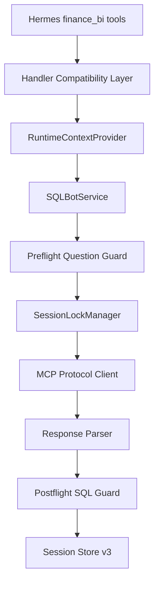

# v1.12 hermes-sqlbot-adapter 修复计划

目标组件：[expert-templates/bi-strategic-office/plugins/hermes-sqlbot-adapter](expert-templates/bi-strategic-office/plugins/hermes-sqlbot-adapter)，依据 [prd/v1.12_hotfix-sqlbot-adapter.md](prd/v1.12_hotfix-sqlbot-adapter.md)。不改 SQLBot 镜像/源码。

当前代码已确认 **P0–P1 全部仍开放**（错误 MCP 参数名、`data.data` 未解析、handler 丢弃 runtime kwargs、ask 复用旧 `chat_id`、wheel 缺子包等）。



---

## 阶段 1：P0 协议修复（rc1）

### 1. Handler 兼容层 + 运行上下文
- 改 [handlers/tools.py](expert-templates/bi-strategic-office/plugins/hermes-sqlbot-adapter/sqlbot_adapter/handlers/tools.py)：统一 `params: dict | None = None, **runtime_kwargs`；`normalize_handler_params` 支持 dict / kwargs 双调用；显式传 `hermes_ctx` 给 Service。
- 改 [runtime_context.py](expert-templates/bi-strategic-office/plugins/hermes-sqlbot-adapter/sqlbot_adapter/runtime_context.py)：Gateway 禁止回退固定 `cli-session`；无 `user_id` 时用 `session_id` 隔离；CLI 必须显式 `SQLBOT_CLI_SESSION_ID`。

### 2. MCP 参数与 Client
- 改 [client/mcp_client.py](expert-templates/bi-strategic-office/plugins/hermes-sqlbot-adapter/sqlbot_adapter/client/mcp_client.py)：
  - `mcp_ws_list` / `mcp_datasource_list` / `mcp_question` 使用 `token`、`oid`（无 datasource 时）、`stream`、`lang`、`return_img`。
  - **禁止**发送 `access_token` / `workspace_id` / `response_mode`。
  - `response_mode` 仅映射为 `return_img`（`chart`→true，其余 false）。

### 3. 成功/失败解析
- 改 [client/result_parser.py](expert-templates/bi-strategic-office/plugins/hermes-sqlbot-adapter/sqlbot_adapter/client/result_parser.py)：
  - 顶层 `sql` / `title` / `record_id`；`data.fields` + `data.data` 行。
  - 兼容旧格式；`success=false` / `isError` / `exec-sql-err` → 标准错误，缺关键字段 → `SQLBOT_RESPONSE_INVALID`。
  - `ParsedQuestion` 增加 `upstream_record_id`。

### 4. ask / followup 语义
- 改 [service.py](expert-templates/bi-strategic-office/plugins/hermes-sqlbot-adapter/sqlbot_adapter/service.py)：
  - `ask`：**每次** `mcp_start` 新建 Token+`chat_id`，覆盖 Session 映射。
  - `followup`：仅复用当前 Session；无映射或 Token 失效 → `SQLBOT_SESSION_EXPIRED`。
  - `data_and_summary` 默认不返回 chart。

### 5. Packaging
- 改 [pyproject.toml](expert-templates/bi-strategic-office/plugins/hermes-sqlbot-adapter/pyproject.toml)：`packages.find include=["sqlbot_adapter*"]`；version `1.12.0`；entry-point `hermes_agent.plugins` → `sqlbot_adapter.plugin:register`。
- 新增 `sqlbot_adapter/plugin.py`；根 `__init__.py` 仅转调 register，去掉 `sys.path` 注入；`schemas.py` 迁入包内；[plugin.yaml](expert-templates/bi-strategic-office/plugins/hermes-sqlbot-adapter/plugin.yaml) → 1.12.0。

**验收**：用 fixture 解析真实成功 JSON 得非空 sql/rows；handler 可 dict 调用；`python -c "from sqlbot_adapter.client.mcp_client import SQLBotMCPClient"` 在 wheel 安装后成功。

---

## 阶段 2：会话与可靠性（rc2）

| 项 | 改动文件 | 要点 |
|---|---|---|
| `isError` | `result_parser.py` / `mcp_client.py` | `CallToolResult.isError` 为真则映射 `SQLBOT_TOOL_ERROR`，不进成功解析 |
| 超时取消 | `async_bridge.py` + `mcp_client.py` | 协程内 `asyncio.timeout`；同步超时 `future.cancel()` 并等待确认；禁止 `mcp_question` 自动重试 |
| SSL/超时配置 | `mcp_client.py` / `config.py` | `verify_ssl`、connect/read/write 超时接到实际 HTTP/SSE 客户端 |
| Token 过期 | `session_store.py` / `service.py` | 读 Session 同时查 TTL + `token_expires_at`；ask 重建；followup 报过期 |
| Session 锁 | 新增 `session/locks.py` | 进程内 `threading.RLock`，key=`profile/session/user`，覆盖 start/question/store 更新 |
| Schema v3 | `session_store.py` / `models.py` | 增列 + `PRAGMA table_info` 幂等 `ALTER`；v1→v2→v3；失败不抬版本 |
| explain 历史 | `service.py` / `session_store.py` | `query_id` 查当前 Session 的 `sqlbot_queries`；无 id 用最近一次 |
| 单例锁 | `service.py` | `get_service()` 双重检查 + 线程锁 |
| 数据源 | `config.py` | 未知 `datasource_key` → `INVALID_DATASOURCE_KEY`（空键仍用默认） |

---

## 阶段 3：查询与结果治理（rc3）

### Preflight（提交前）
- 新增 `security/question_guard.py`：长度限制、明细须含编号/日期/实体、禁止改删建/存储过程、数据源白名单校验；在 `ask`/`followup` 调 MCP **之前**调用。

### Postflight SQL Guard
- 改 [security/query_guard.py](expert-templates/bi-strategic-office/plugins/hermes-sqlbot-adapter/sqlbot_adapter/security/query_guard.py)：
  - sqlglot 方言 `tsql`；禁止 `SELECT INTO`、DML/DDL/EXEC/CALL/MERGE、跨库多段名、系统 schema。
  - 业务编号配置驱动（`交易凭证编号`/`应收交易编号` 等）；值必须落在 WHERE/JOIN ON/HAVING 的 `=`/`IN` 谓词，禁止仅字符串包含。

### 结果治理
- 改 [result_guard.py](expert-templates/bi-strategic-office/plugins/hermes-sqlbot-adapter/sqlbot_adapter/security/result_guard.py) / [result_normalizer.py](expert-templates/bi-strategic-office/plugins/hermes-sqlbot-adapter/sqlbot_adapter/normalizer/result_normalizer.py)：
  - 行截断：`MODEL_RESULT_ROWS` / `MAX_RESULT_ROWS`（超硬上限截断到上限，不整包丢弃）。
  - 新增列数上限、字节上限；标准字段含 `upstream_record_id`、`returned_row_count`、`request_id`。
- [errors.py](expert-templates/bi-strategic-office/plugins/hermes-sqlbot-adapter/sqlbot_adapter/errors.py)：补 PRD §14 错误码；工具结果/日志剥离 Token、密码、`chat_id`、密钥。

### 配置扩展
- [config.py](expert-templates/bi-strategic-office/plugins/hermes-sqlbot-adapter/sqlbot_adapter/config.py)：整数 env 强校验；`SQLBOT_DATASOURCES_JSON`（dialect/identifiers）；`lang`、列/字节上限、查询/审计保留期。

### 审计与清理
- [audit_repository.py](expert-templates/bi-strategic-office/plugins/hermes-sqlbot-adapter/sqlbot_adapter/audit/audit_repository.py)：目录 `0700`、文件 `0600`、写锁、字段白名单、保留期清理；Session Store 启动/每日轻量清理历史查询。

---

## 阶段 4：测试、脚本与文档（正式 1.12.0）

### 测试（当前 `tests/` 为空）
新增至少覆盖 PRD §19.1 的用例 + fixtures：
- `tests/fixtures/mcp_question_success.json`（脱敏真实成功体）
- 失败 / isError / message 内嵌 JSON fixtures
- 单元：parser、query_guard（TOP 通过 / INTO 拒绝 / 编号谓词）、datasource、handler dict+kwargs、session 隔离、ask 换会话、followup 复用、token 过期、schema 迁移、wheel 子包存在性

### 脚本与 README
- [scripts/direct_flow_test.py](expert-templates/bi-strategic-office/plugins/hermes-sqlbot-adapter/scripts/direct_flow_test.py)：与生产 Client 同协议；增加 `--url/--oid/--datasource-id`。
- [README.md](expert-templates/bi-strategic-office/plugins/hermes-sqlbot-adapter/README.md)：删虚构 `--deep`；写清部署/验证/故障；标明 SQL Guard 为**执行后校验**。
- 同步更新 [expert-templates/bi-strategic-office/README.md](expert-templates/bi-strategic-office/README.md) 中 adapter 相关说明（模板更新规则）；**不**往根 README 写更新流水账。

---

## 实施顺序与验证门禁

```text
阶段1 → 协议 fixture + handler 冒烟 + wheel import
阶段2 → token/lock/timeout/migration 单测
阶段3 → preflight/postflight/result 单测
阶段4 → 全量 pytest；可选 hermes-bi-finance 容器集成（connection_test / direct_flow / 四工具验收）
```

本地验证命令（实施时执行）：

```bash
cd expert-templates/bi-strategic-office/plugins/hermes-sqlbot-adapter
python -m pytest tests/ -q
python -m build && unzip -l dist/*-1.12.0-*.whl | findstr sqlbot_adapter/client
```

---

## 明确不做

- 不改 SQLBot 镜像或 SQLBot 内部代码。
- 不在 Adapter 内自行生成/直连业务库执行 SQL。
- 不向模型暴露 Token / 密码 / `chat_id` / 工作空间或数据源内部 ID。
- 首版 Session 锁仅进程内 RLock（PRD 约定多进程前固定单进程部署）。
