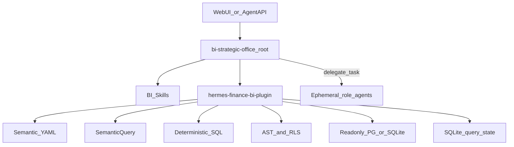

# 财务分析 BI 专家（PRD v1.9）实施计划

## 架构决策（按 PRD，不按 CEO 团队）

| 维度 | CEO（v1.8） | BI（v1.9） |
|------|-------------|------------|
| Manifest | `team.yaml` + 7 永久 Profile | **无** `team.yaml`，单 root 专家 |
| 编排 | Kanban | Skill 编排 + `delegate_task` 按需子角色 |
| 核心能力 | Agency Router | **`hermes-finance-bi-plugin`（进程内 Toolset）** |
| 创建命令 | `create-instance.sh … ceo-strategic-office` | `create-instance.sh bi-strategic-office 8790 bi-strategic-office` |

角色（Director / Query Analyst / Performance / Semantic / Quality）落在 [`skills/bi-office-orchestration/references/roles/`](expert-templates/bi-strategic-office/skills/bi-office-orchestration/references/roles/)，由主 Agent 按需 `delegate_task`，**不为角色开独立容器/端口**。



---

## 现状可复用点

- 单专家注入：[`scripts/inject-expert.sh`](scripts/inject-expert.sh)（`base` + `expert` 覆盖；有 `team.yaml` 才走团队脚本）
- 插件注册样例：[`instances/skill-package-installer/`](instances/skill-package-installer/)（`plugin.yaml` + `register(ctx)` + handler 返回 JSON 字符串）
- 插件依赖安装模式：[`scripts/import-assets.sh`](scripts/import-assets.sh) 对容器 `pip install -r requirements.txt`
- 目录初始化：[`scripts/lib/init_hermes_dirs.sh`](scripts/lib/init_hermes_dirs.sh)

**缺口（本计划补齐）**：`asset-bundles/` 目前只有 tarball 分发约定，尚无源码型 Hermes 插件包；`inject-expert` 不处理 `config.patch.yaml` 深度合并、不安装 `finance-bi` 语义/插件路径、不初始化 `FINANCE_BI_*`。

---

## 阶段 1：专家模板 `bi-strategic-office`（T02）

新增 [`expert-templates/bi-strategic-office/`](expert-templates/bi-strategic-office/)：

```text
SOUL.md                          # 身份/问数规则/输出契约；禁止写表结构与 SQL
config.patch.yaml                # agent/delegation/display（PRD §11）
memories/MEMORY.md
skills/
  bi-office-orchestration/       # 主编排 + roles/*.md（4 子角色提示）
  finance-bi-query/
  finance-performance-analysis/
  semantic-governance/
  data-quality-review/
  management-reporting/
semantic/                        # MVP YAML（见阶段 3）
  datasources/ datasets/ metrics/ dimensions/ joins/ glossary/ examples/
policies/                        # 查询策略、脱敏、成本上限示例
```

与现有 `finance` 边界写进 SOUL：资金运营归 `finance`；BI 取数/利润分析/口径解释归本专家。

---

## 阶段 2：插件骨架 + 六工具（T03/T07）

新增源码包 [`asset-bundles/hermes-finance-bi-plugin/`](asset-bundles/hermes-finance-bi-plugin/)（对齐 PRD §10，注册方式对齐 `skill-package-installer`）：

| 路径 | 职责 |
|------|------|
| `plugin.yaml` | name/version/`provides_tools` |
| `__init__.py` | `register(ctx)` → toolset `finance-bi` |
| `finance_bi/config.py` | 读 `FINANCE_BI_*` |
| `finance_bi/contracts.py` | SemanticQuery / 错误码（PRD §13） |
| `catalog/` `planner/` `compiler/` `policy/` `executor/` `repository/` `results/` `export/` `handlers/` | 流水线 |
| `requirements.txt` | `sqlalchemy`、`psycopg[binary]`、`sqlglot`、`openpyxl`、`pyyaml` |
| `tests/` | SQLite fixture，不连生产库 |

六工具 handler **一律返回 JSON 字符串**，异常转统一错误码，禁止抛到 Agent Loop：

- `finance_bi_ask` / `finance_bi_followup` / `finance_bi_explain`
- `finance_bi_catalog_search` / `finance_bi_validate_result` / `finance_bi_export_result`

导出目录固定：`/data/hermes/workspace/exports/bi/`。

---

## 阶段 3：语义目录 + 规划/编译（T04/T05）

- YAML schema 校验：禁止重复指标名、禁止悬空数据集/字段引用
- MVP 数据集至少覆盖验收问句：`product_profit_daily`（净销售额、毛利、毛利率、产品/区域维度、主体字段）
- Planner：NL → 语义检索 → `SemanticQuery`；歧义返回 `CLARIFICATION_REQUIRED`
- Compiler：仅由确定性编译器产出 SQL；`2026Q2` → `[2026-04-01, 2026-07-01)`；毛利率按聚合后金额计算
- **不注册** `execute_sql` / `run_raw_sql` / `query_database`

---

## 阶段 4：策略、执行、状态审计（T06/T08）

- SQLGlot AST：仅 `SELECT`/`WITH`；禁多语句/DDL/DML；schema/表/字段/JOIN 白名单；强制 LIMIT
- 注入 `FINANCE_BI_ALLOWED_ENTITIES`；statement timeout；只读事务；连接池
- SQLite 状态库：`FINANCE_BI_STATE_DB`（默认 `/data/hermes/finance-bi/state/finance_bi.db`）；保存 `query_id` + SemanticQuery；**不存结果集**；默认 7 天清理
- 审计字段按 PRD §FR-09；脱敏客户/金额明细

---

## 阶段 5：部署脚本改造（T01/T09/T10）

**修改**

- [`scripts/inject-expert.sh`](scripts/inject-expert.sh)：当 `EXPERT=bi-strategic-office`（或模板含 `semantic/` + 插件约定）时，在现有 copy 之后追加 BI 步骤：
  1. 深度合并 `config.patch.yaml` → `config.yaml`（保留用户 `model`/`providers`）
  2. 同步 semantic/policies → `$DATA_DIR/finance-bi/{semantic,policies}`
  3. 复制插件源码 → `$DATA_DIR/plugins/hermes-finance-bi-plugin/`
  4. `mkdir` state + `workspace/exports/bi`
  5. 向实例 `.env` **幂等追加** `FINANCE_BI_*` 占位（不覆盖已有值、不写真实 DSN）
  6. 若容器已运行：`pip install -r` 插件 `requirements.txt`（复用 import-assets 模式）
- [`scripts/lib/init_hermes_dirs.sh`](scripts/lib/init_hermes_dirs.sh)：增加 `finance-bi/{semantic,policies,state}`、`workspace/exports/bi`
- [`.env.example`](.env.example)：补充 `FINANCE_BI_*` 注释块
- [`Dockerfile`](Dockerfile)：将插件硬依赖（`sqlalchemy`/`sqlglot`/`openpyxl`/`pyyaml`/`psycopg`）固化进镜像，避免每次注入才装（`requirements.txt` 仍保留作版本声明）

**新增**

- [`scripts/check-finance-bi.sh`](scripts/check-finance-bi.sh)：插件加载、六工具、配置、语义校验、DB 连通/只读探测、导出目录可写
- [`scripts/sync-bi-semantic-catalog.sh`](scripts/sync-bi-semantic-catalog.sh)：模板 semantic → 实例路径，幂等
- [`scripts/validate-expert-template.sh`](scripts/validate-expert-template.sh)：模板结构校验（BI 与通用专家）
- [`scripts/lib/merge_config_patch.py`](scripts/lib/merge_config_patch.py)：YAML 深度合并

`create-instance.sh` **不改参数顺序**；继续只调 `inject-expert.sh`。

---

## 阶段 6：测试与验收（T11/T12）

**单测**（插件 `tests/` + 仓库 `tests/`）：语义加载、时间解析、指标/JOIN 编译、AST 安全、主体权限、SQLite 执行、followup、explain、导出、审计脱敏、重复注入。

**部署验收**

```bash
bash scripts/create-instance.sh bi-strategic-office 8790 bi-strategic-office
# 配置 FINANCE_BI_DSN（或测试用 SQLite dialect）
bash scripts/up-instance.sh bi-strategic-office
bash scripts/check-finance-bi.sh bi-strategic-office
```

**回归**：`writer` / `finance` / `sale` 创建与注入行为不变。

**文档**：更新 [`README.md`](README.md)、[`README_DEPLOY.md`](README_DEPLOY.md)；PRD 文件保持 [`prd/v1.9_strategic-office-finance-bi.md`](prd/v1.9_strategic-office-finance-bi.md)（不另造重复 PRD，除非需要短链索引）。

---

## 明确不改动

- Hermes Agent 核心循环 / 工具注册协议 / 消息格式
- Docker Compose 服务数与端口模型
- `expert-templates/{writer,finance,sale,ceo-strategic-office}` 语义
- 任意原始 SQL Tool
- 生产 DSN/密码入库

---

## 建议实施顺序与验证

1. 模板骨架 + merge/inject BI 钩子 → `inject-expert` 幂等、目录就位  
2. 插件 register + 假 catalog 健康检查 → `hermes plugins list` / tools 可见  
3. catalog → planner → compiler → policy（纯单测）  
4. executor + state + 六工具 + SQLite fixture  
5. doctor 脚本 + 文档 + 三专家回归  
