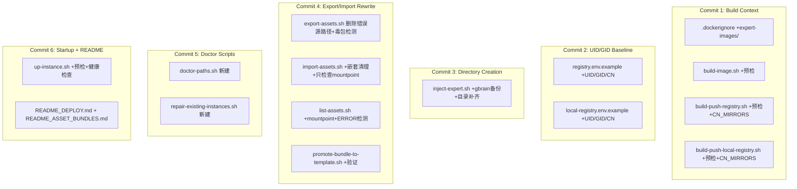

# 路径统一治理实施计划

## 现状诊断

对比 PRD 与当前代码，已合规和需修复的部分如下：

### 已合规（无需改动或仅微调）

| 文件 | 状态 |
|------|------|
| [Dockerfile](Dockerfile) | UID/GID 1000、权限统一、`/opt/hermes-agent` 仅源码用途 — 已合规 |
| [docker-compose.yml](docker-compose.yml) | volumes 三条、`user: "1000:1000"`、WANTED_UID/GID 固定、环境变量路径 — 已合规 |
| [.dockerignore](.dockerignore) | 基本合规，仅缺 `expert-images/` |
| [scripts/create-instance.sh](scripts/create-instance.sh) | 目录创建基本齐全，UID/GID 1000 — 缺 `workspace` 顶级目录单独创建（子目录已有） |

### 需修复（按严重程度排序）

| 文件 | 问题 | PRD 章节 |
|------|------|----------|
| **[scripts/export-assets.sh](scripts/export-assets.sh)** | **关键 BUG**：L32-50 从 `~/.hermes/tools`、`/opt/hermes-agent/tools` 复制进 bundle，直接导致 `tools/tools` 嵌套 | 10 |
| [scripts/import-assets.sh](scripts/import-assets.sh) | 缺少解压前/后 `tools/tools`、`plugins/plugins` 清理 | 11 |
| [scripts/up-instance.sh](scripts/up-instance.sh) | 无启动前目录校验、无 symlink 清理、无启动后健康检查 | 9 |
| [scripts/inject-expert.sh](scripts/inject-expert.sh) | 备份缺 `gbrain`；目录补齐缺 `skills/mcp/policies/skill-bundles/gbrain` | 8 |
| [scripts/list-assets.sh](scripts/list-assets.sh) | 缺 mountpoint 检查、`tools/tools` 检测、ERROR 输出 | 12 |
| [scripts/promote-bundle-to-template.sh](scripts/promote-bundle-to-template.sh) | 缺解压后 `tools/tools` 验证和禁止文件过滤 | 13 |
| [scripts/build-image.sh](scripts/build-image.sh) | 缺 `.dockerignore` 预检 | 14 |
| [scripts/build-push-registry.sh](scripts/build-push-registry.sh) | 缺 `.dockerignore` 预检、缺 CN_MIRRORS build-arg | 14 |
| [scripts/build-push-local-registry.sh](scripts/build-push-local-registry.sh) | 同上 | 14 |
| [registry.env.example](registry.env.example) | 缺 UID/GID、USE_CN_MIRRORS 等 | 15 |
| [local-registry.env.example](local-registry.env.example) | 同上 | 15 |

### 需新增

| 文件 | PRD 章节 |
|------|----------|
| `scripts/doctor-paths.sh` | 17 |
| `scripts/repair-existing-instances.sh` | 18 |

---

## Commit 1: .dockerignore + 构建脚本预检

### [.dockerignore](.dockerignore)
- 在 `asset-bundles/` 后新增 `expert-images/`（PRD 6）

### [scripts/build-image.sh](scripts/build-image.sh)
- 构建前新增检查：

```bash
test -f "$BASE_DIR/.dockerignore" || { echo "ERROR: .dockerignore missing"; exit 1; }
grep -q '^instances/$' "$BASE_DIR/.dockerignore" || { echo "ERROR: .dockerignore must exclude instances/"; exit 1; }
```

### [scripts/build-push-registry.sh](scripts/build-push-registry.sh)
- 同上新增 `.dockerignore` 预检
- BUILD_CMD 中新增 4 个 build-arg：

```bash
--build-arg "USE_CN_MIRRORS=${USE_CN_MIRRORS:-1}"
--build-arg "APT_MIRROR=${APT_MIRROR:-https://mirrors.aliyun.com/debian}"
--build-arg "PIP_INDEX_URL=${PIP_INDEX_URL:-https://mirrors.aliyun.com/pypi/simple/}"
--build-arg "NPM_REGISTRY=${NPM_REGISTRY:-https://registry.npmmirror.com}"
```

- 在变量读取段补上 `USE_CN_MIRRORS`/`APT_MIRROR`/`PIP_INDEX_URL`/`NPM_REGISTRY`

### [scripts/build-push-local-registry.sh](scripts/build-push-local-registry.sh)
- 同上新增 `.dockerignore` 预检 + CN_MIRRORS build-arg

---

## Commit 2: UID/GID 基线 + docker-compose volumes

docker-compose.yml 和 Dockerfile 已合规，无需改动。

### [registry.env.example](registry.env.example)
- 尾部新增：

```env
# 构建/运行 UID/GID（必须与 Dockerfile 一致）
UID=1000
GID=1000
USE_CN_MIRRORS=1
APT_MIRROR=https://mirrors.aliyun.com/debian
PIP_INDEX_URL=https://mirrors.aliyun.com/pypi/simple/
NPM_REGISTRY=https://registry.npmmirror.com
```

### [local-registry.env.example](local-registry.env.example)
- 同上在尾部追加相同变量块

---

## Commit 3: create-instance + inject-expert 目录补齐

### [scripts/inject-expert.sh](scripts/inject-expert.sh)

**备份循环**（L31）：加入 `gbrain`

```bash
for d in skills tools plugins mcp policies skill-bundles gbrain; do
```

**目录补齐**（L56 之后的 mkdir -p）：补充 `skills`、`mcp`、`policies`、`skill-bundles`、`gbrain`

```bash
mkdir -p \
  "$DATA_DIR/skills" \
  "$DATA_DIR/tools" \
  "$DATA_DIR/plugins" \
  "$DATA_DIR/mcp" \
  "$DATA_DIR/policies" \
  "$DATA_DIR/skill-bundles" \
  "$DATA_DIR/gbrain" \
  "$DATA_DIR/workspace/materials" \
  ...
```

---

## Commit 4: 重写 export-assets + import-assets

### [scripts/export-assets.sh](scripts/export-assets.sh) — 关键修复

**删除 L32-50**（从 `~/.hermes/tools`、`~/.hermes/plugins`、`/opt/hermes-agent/tools`、`/opt/hermes-agent/plugins` 复制的逻辑），只保留 `/data/hermes` 导出：

```bash
docker exec "$CONTAINER" bash -lc "
set -e
rm -rf '$TMP_DIR'
mkdir -p '$TMP_DIR'

for d in skills tools plugins mcp policies skill-bundles gbrain; do
  if [ -d /data/hermes/\$d ]; then
    cp -a /data/hermes/\$d '$TMP_DIR/' || true
  fi
done

cd '$TMP_DIR'
tar czf /tmp/data-hermes-assets.tgz .
"
```

**新增毒包检测**（导出后）：

```bash
tar tzf "$OUT_DIR/data-hermes-assets.tgz" \
  | grep -E '(^|/)tools/tools($|/)|(^|/)plugins/plugins($|/)' && {
    echo "ERROR: invalid nested tools/plugins path detected in bundle"
    rm -f "$OUT_DIR/data-hermes-assets.tgz"
    exit 1
  } || true
```

**新增 `--migrate-agent-tools` 参数支持**：可选，从 `/opt/hermes-agent/tools` 按白名单迁移到 `/data/hermes/tools` 后再导出。

### [scripts/import-assets.sh](scripts/import-assets.sh)

**解压前清理**（在 tar xzf 之前）：

```bash
rm -f "$TARGET_DIR/tools/tools" 2>/dev/null || true
rm -f "$TARGET_DIR/plugins/plugins" 2>/dev/null || true
```

**解压后再清理一次**（在 tar xzf 之后）：

```bash
rm -f "$TARGET_DIR/tools/tools" 2>/dev/null || true
rm -f "$TARGET_DIR/plugins/plugins" 2>/dev/null || true
```

**容器内操作**（L58-65）：去掉 mountpoint 操作，只做检查：

```bash
docker exec -u root "$CONTAINER" bash -lc '
  test -d /data/hermes/tools || echo "WARN: /data/hermes/tools missing"
  test -d /data/hermes/plugins || echo "WARN: /data/hermes/plugins missing"
  mountpoint -q /home/hermeswebui/.hermes/tools || echo "WARN: ~/.hermes/tools not a mountpoint"
  mountpoint -q /home/hermeswebui/.hermes/plugins || echo "WARN: ~/.hermes/plugins not a mountpoint"
  chown -R 1000:1000 /data/hermes/tools /data/hermes/plugins
  chmod -R u+rwX,g+rwX /data/hermes/tools /data/hermes/plugins
'
```

### [scripts/list-assets.sh](scripts/list-assets.sh)

增强输出：增加 mountpoint 检查、`tools/tools` / `plugins/plugins` 检测，异常时输出 `ERROR`。

### [scripts/promote-bundle-to-template.sh](scripts/promote-bundle-to-template.sh)

解压后增加验证：

```bash
for bad in "$TPL_DIR/tools/tools" "$TPL_DIR/plugins/plugins" \
           "$TPL_DIR/.env" "$TPL_DIR/sessions" "$TPL_DIR/logs" \
           "$TPL_DIR/webui" "$TPL_DIR/hindsight" "$TPL_DIR/workspace" \
           "$TPL_DIR/obsidian-vault" "$TPL_DIR/memories"; do
  if [ -e "$bad" ]; then
    echo "ERROR: prohibited path in template: $bad"
    exit 1
  fi
done
```

---

## Commit 5: 新增 doctor-paths + repair-existing-instances

### `scripts/doctor-paths.sh`（新建）

按 PRD 17：

- 用法：`bash scripts/doctor-paths.sh <profile> [--fix]`
- 检查项：
  1. `instances/<profile>/data/hermes` 存在
  2. 7 个子目录存在（tools/plugins/skills/mcp/policies/skill-bundles/gbrain）
  3. 不存在 `tools/tools`、`plugins/plugins`
  4. 宿主机目录可写
  5. 容器运行时检查（UID/GID、mountpoint、`/app/venv` 可写）
- `--fix` 模式：创建缺失目录、删除错误嵌套、chown/chmod
- 输出 `PASS` 或 `FAIL`

### `scripts/repair-existing-instances.sh`（新建）

按 PRD 18：

- 遍历 `instances/*/data/hermes`
- 补齐目录、删除 `tools/tools`/`plugins/plugins`、chown/chmod
- 不处理 `.env`、`config.yaml`、`memories` 等个人数据

---

## Commit 6: 更新 up-instance + README

### [scripts/up-instance.sh](scripts/up-instance.sh)

按 PRD 9 增强：

**启动前目录校验**（在 compose up 之前）：

```bash
DATA_DIR="$BASE_DIR/instances/$PROFILE/data/hermes"
mkdir -p "$DATA_DIR/tools" "$DATA_DIR/plugins" "$DATA_DIR/skills" \
         "$DATA_DIR/mcp" "$DATA_DIR/policies" "$DATA_DIR/skill-bundles" "$DATA_DIR/gbrain"
rm -f "$DATA_DIR/tools/tools" 2>/dev/null || true
rm -f "$DATA_DIR/plugins/plugins" 2>/dev/null || true
chown -R 1000:1000 "$DATA_DIR/tools" "$DATA_DIR/plugins" "$DATA_DIR/skills" 2>/dev/null || true
chmod -R u+rwX,g+rwX "$DATA_DIR/tools" "$DATA_DIR/plugins" "$DATA_DIR/skills" 2>/dev/null || true
```

**启动后健康检查**：

```bash
sleep 3
STATE=$(docker inspect --format '{{.State.Status}}' "hermes-$PROFILE" 2>/dev/null || echo "unknown")
if [ "$STATE" = "restarting" ]; then
  echo "ERROR: container is restarting"
  docker logs --tail=80 "hermes-$PROFILE"
  exit 1
fi
```

### README 更新

在 [README_DEPLOY.md](README_DEPLOY.md) 和 [README_ASSET_BUNDLES.md](README_ASSET_BUNDLES.md) 中新增"路径规则"章节，阐明：

- 唯一主目录：`/data/hermes`
- 实例目录：`instances/<profile>/data/hermes`
- 兼容路径：`~/.hermes/tools`、`~/.hermes/plugins` 由 compose bind mount
- 源码路径：`/opt/hermes-agent` 只属于镜像
- 禁止手工在 `~/.hermes/tools` 内创建 tools 软链
- 禁止从 `/opt/hermes-agent/tools` 直接当作实例资产分发

---

## 变更影响汇总



## 不涉及变更的文件

- `Dockerfile` — 已合规
- `docker-compose.yml` — 已合规
- `scripts/create-instance.sh` — 已基本合规（`workspace` 子目录已覆盖）
- `expert-templates/` — 当前无 `tools/tools` 或 `plugins/plugins`，无需修改
- `instances/` — 由 `repair-existing-instances.sh` 运行时修复
